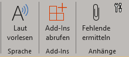
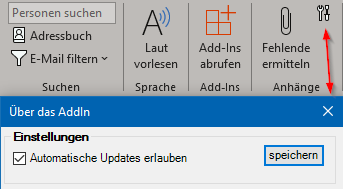

# OutlookAddIn: Keep attachments on reply 

## Features
- Bei "antworten" und "allen antworten" werden die Mailanhänge automatisch eingefügt
- Button um bei bestehenden Mails die letzten Anhänge wiedereinzufügen  
      
    - Bei signierten Mails wird das Mail dafür ohne Zertifikat dupliziert
    - Es können auch mehrere Mails markiert werden 
- Auto-Update Funktion (in Einstellungen deaktivierbar)  
    

## Changelog
... [findet sich hier](CHANGELOG.md) ...

## Auto-Update?
Beim Starten von Outlook, 1x pro 24h, wird auf GitHub die Version überprüft. Gibt es eine neuere Version, wird diese als zip-Datei heruntergeladen und entpackt. Beim nächsten Outlook-Neustart wird die neuere Version dann via ClickOnce-Update nachgeführt.

Wenn Outlook nie geschlossen und gestartet wird, wird auch kein Update installiert.

## Fehler melden
Es dürfen gerne [hier](https://github.com/ahaenggli/OutlookAddIn_KeepAttachmentsOnReply/issues) in GitHub Issues erfasst werden.